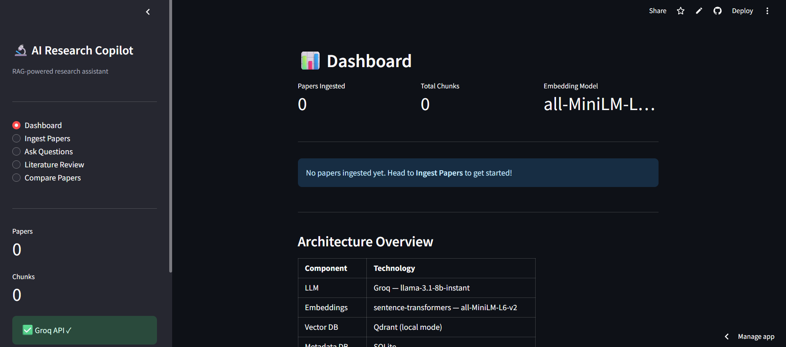
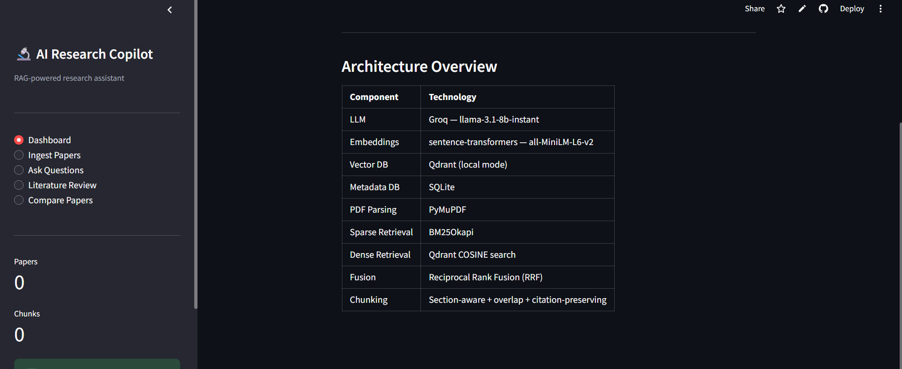
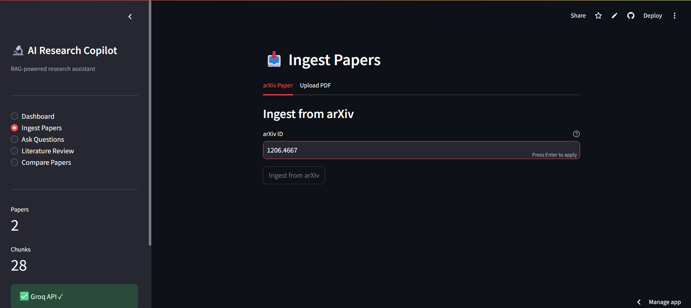

# AI-Research-Paper-Copilot

## 🚀 Live Demo

https://ai-research-paper-copilot-wmu8cjdd3fc3kt8ryogn4c.streamlit.app/

## 🔬 AI Research Copilot

A production-grade multi-paper RAG system for research intelligence, citation-grounded reasoning, and advanced hybrid retrieval — engineered to demonstrate real-world GenAI architecture beyond toy demos.

## 🚀 Why This Project Stands Out

Most GenAI projects stop at:

PDF chat
Basic vector search
Naive embeddings
Single-document Q&A

This project goes significantly deeper.

AI Research Copilot is designed like a real retrieval system used in modern AI startups:

Hybrid Retrieval (BM25 + Dense)
Reciprocal Rank Fusion (RRF)
Citation-grounded answers
Multi-paper reasoning
Literature review generation
Research paper comparison
Section-aware chunking
Production-oriented architecture
Optimized for low-cost deployment

This is not just a demo app — it is a miniature research intelligence platform.

## ✨ Features
📄 Multi-Paper Research Intelligence

Ingest multiple research papers from:

arXiv
User-uploaded PDFs

The system creates a searchable research knowledge base.

## 🧠 Advanced Hybrid Retrieval

Instead of relying only on embeddings, the system combines:

Sparse Retrieval
BM25 keyword search
Dense Retrieval
Semantic embeddings using Sentence Transformers
Fusion Strategy
Reciprocal Rank Fusion (RRF)

This significantly improves retrieval quality compared to naive vector-only pipelines.

## 📚 Citation-Grounded Answers

Every generated answer is grounded in retrieved evidence.

The system:

Retrieves relevant chunks
Preserves paper metadata
Includes section + page references
Forces grounded generation through structured prompting

This reduces hallucinations and improves trustworthiness.

## 🧾 Automated Literature Review Generation

Generate structured literature reviews across multiple papers:

Synthesizes findings
Compares approaches
Identifies research gaps
Produces academic-style summaries
##⚖️ Research Paper Comparison

Compare papers by:

Methodology
Datasets
Experimental setup
Results
Conclusions

Useful for:

Research analysis
Interview discussions
Academic workflows

## ✂️ Smart Chunking Pipeline

Unlike naive fixed-window chunking, this system includes:

Section-aware splitting
Overlapping context windows
Citation-preserving boundaries
Metadata-aware chunks

This improves retrieval precision significantly.

## 🏗️ System Architecture

```text
                ┌────────────────────┐
                │   Research Papers   │
                │ (arXiv / PDFs)      │
                └─────────┬──────────┘
                          │
                          ▼
                ┌────────────────────┐
                │   PDF Extraction    │
                │      PyMuPDF        │
                └─────────┬──────────┘
                          │
                          ▼
                ┌────────────────────┐
                │   Smart Chunking    │
                │  Section-aware RAG  │
                └─────────┬──────────┘
                          │
            ┌─────────────┴─────────────┐
            ▼                           ▼

   ┌────────────────┐        ┌────────────────┐
   │ Dense Embedding │        │ BM25 Indexing │
   │ SentenceTransf. │        │ Sparse Search │
   └────────┬───────┘        └────────┬───────┘
            │                         │
            ▼                         ▼

      ┌────────────────────────────────────┐
      │     Reciprocal Rank Fusion         │
      │               (RRF)                │
      └────────────────┬───────────────────┘
                       │
                       ▼

            ┌────────────────────┐
            │  Context Assembly   │
            │    + Citations      │
            └─────────┬──────────┘
                      │
                      ▼

            ┌────────────────────┐
            │ Groq LLM Generation │
            └────────────────────┘
```

# 🖥️ Application Preview

## 📊 Dashboard



---





## 📥 Paper Ingestion 




